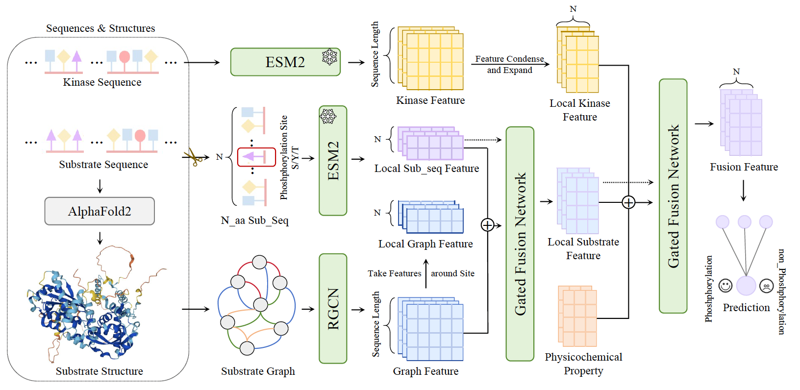

# SAGEPhos: Sage Bio-Coupled and Augmented Fusion for Phosphorylation Site Detection


[](https://arxiv.org/abs/2502.07384)


This repository contains the open-source implementation of the paper "[SAGEPHOS: SAGE BIO-COUPLED AND AUGMENTED FUSION FOR PHOSPHORYLATION SITE DETECTION](https://openreview.net/forum?id=hLwcNSFhC2)". 

## Table of Contents
- [Introduction](#introduction)
- [Installation](#installation)
- [Usage](#usage)
  - [Training](#training)
  - [Testing](#testing)
- [Citation](#citation)
- [Contact](#contact)


## Introduction

**SAGEPhos** introduces a **Bio-Coupled Modal Fusion** method, distilling essential kinase sequence information to refine task-oriented local substrate feature space. It creates a shared semantic space that captures crucial kinase-substrate interaction patterns. Within the substrate’s intra-modality domain, it focuses on **Bio-Augmented Fusion**, emphasizing 2D local sequence information while selectively incorporating 3D spatial information from predicted structures to complement the sequence space.

[Read the paper here.](https://arxiv.org/abs/2502.07384)




## Installation

1. **Clone the repository:**
   ```sh
   git clone https://github.com/ZhangJJ26/SAGEPhos.git
   cd SAGEPhos
   ```

2. **Install dependencies:**

   **Option 1:** Use the `environment.yml` file to set up the environment:
   ```bash
   conda env create -f environment.yml
   conda activate SAGEPhos
   ```

   **Option 2:** Manually install the environment:
   ```bash
   conda create -n SAGEPhos python=3.8
   conda activate SAGEPhos
   conda install torchvision torchaudio pytorch-cuda=12.1 -c pytorch -c nvidia  # Use the appropriate CUDA version for your system.
   conda install torchdrug -c milagraph -c conda-forge -c pytorch -c pyg
   conda install easydict pyyaml -c conda-forge
   conda install scipy joblib wandb
   pip install git+https://github.com/facebookresearch/esm.git
   pip install ninja rdkit-pypi scikit-learn h5py atom3d
   ```

3. **Download the pretrained model:**
   - Download the pretrained model from the [releases page](https://github.com/ZhangJJ26/SAGEPhos/releases/tag/v1.0.0).
   - Extract and place it in the `checkpoint` directory:
     ```sh
     mkdir checkpoint
     tar -xzvf checkpoint.tar.gz -C checkpoint/
     ```


## Usage

### Training
By default, we use 2 NVIDIA A40 GPUs for training. Adjust the batch size according to your GPU memory.

```sh
python script/downstream.py -c config/phos/esm_gearnet_parallel.yaml --ckpt null
```

- `--ckpt`: Specify the path to the model checkpoint. For training, set this to `null`.
- We have uploaded our SAGEPhos dataset on [releases page](https://github.com/ZhangJJ26/SAGEPhos/releases/tag/v1.0.0).

### Testing
To test the model, run the following command:

```sh
python script/downstream.py -c config/phos/esm_gearnet_parallel.yaml --ckpt checkpoint/checkpoint.pth
```

- `--ckpt`: Path to the model checkpoint (default is `checkpoint/checkpoint.pth`).


## Citation
If you use SAGEPhos in your research, please cite our paper:

```bibtex
@article{zhang2025sagephos,
  title={SAGEPhos: Sage Bio-Coupled and Augmented Fusion for Phosphorylation Site Detection},
  author={Zhang, Jingjie and Cao, Hanqun and Gao, Zijun and Wang, Xiaorui and Gu, Chunbin},
  journal={arXiv preprint arXiv:2502.07384},
  year={2025}
}
```

## Contact

If you have any questions, please feel free to contact the authors.

- Jingjie Zhang (1155224008@link.cuhk.edu.hk)
